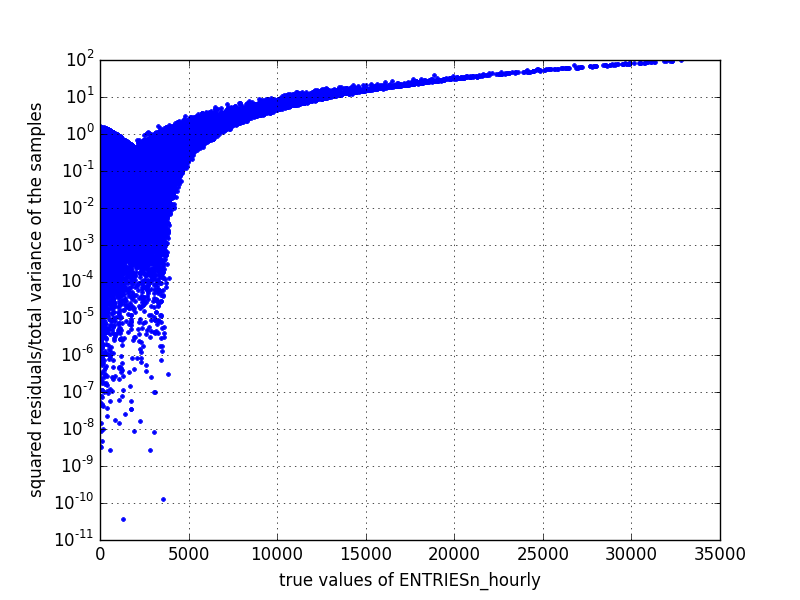
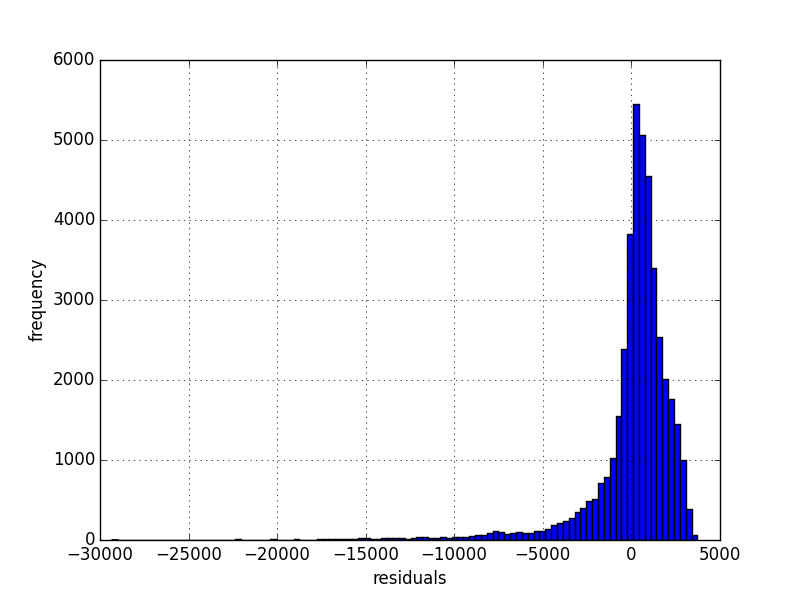
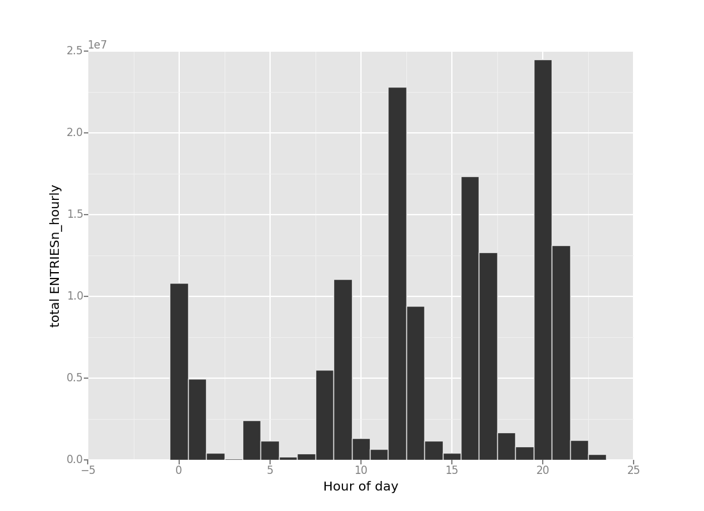

# Analyzing the NYC Subway Dataset
## Questions Overview
**This project consists of two parts. In Part 1 of the project, you should have completed the questions in Problem Sets 2, 3, 4, and 5 in the Introduction to Data Science course.
This document addresses part 2 of the project. Please use this document as a template and answer the following questions to explain your reasoning and conclusion behind your work in the problem sets. You will attach a document with your answers to these questions as part of your final project submission.**

## Section 0. References

**Please include a list of references you have used for this project. Please be specific - for example, instead of including a general website such as stackoverflow.com, try to include a specific topic from Stackoverflow that you have found useful.**


## Section 1. Statistical Test

**1.1 Which statistical test did you use to analyze the NYC subway data? Did you use a one-tail or a two-tail P value? What is the null hypothesis? What is your p-critical value?**

We use Mann-Whitney U Test to compare the ridership of NYC subway in rainy and non-rainy days.
In this test, we choose the column ```ENTRIESn_hourly``` as the response and the column ```rain``` as the feature.
We used a two-tailed test because our goal is to know whether the population of ```ENTRIESn_hourly``` in rainy and non-rainy days differ. The null hypothesis is that the samples of ```ENTRIESn_hourly``` at rainy and non-rainy days come from the same population. The p-critical value is chosen to be 0.05.

**1.2 Why is this statistical test applicable to the dataset? In particular, consider the assumptions that the test is making about the distribution of ridership in the two samples.**

Mann-Whitney U-Test is applicable to the dataset because the distribution of ```ENTRIESn_hourly``` is non-normal, as shown in the histogram plotted in Section 3.1.
Also, this dataset conforms the underlying assumptions of Mann-Whitney U-Test:
- The feature to be analyzed is ordinal and only has two groups.
- Each entries of the data is independent.
- The response is continuous.
- The response of each data entry is distinct.

The variable of this statistical test is whether the weather is raining, thus it is ordinal.
Also, it is reasonable to assume that ```ENTRIESn_hourly``` of each passenger is independent when the population is large. Moreover, the values ```ENTRIESn_hourly``` can be considered as continuous and distinct.

**1.3 What results did you get from this statistical test? These should include the following numerical values: p-values, as well as the means for each of the two samples under test.**

The mean value of ```ENTRIESn_hourly``` in rainy days is 1105.45, while the mean value in non-rainy days is 1090.27. The p-value of Mann-Whitney U-Test is 0.025. Since we are using a two-tailed test, the resulting p-value is 0.025*2=0.05.

```
with rain: 1105.4463767458733,  
without rain: 1090.278780151855,   
U:1924409167.0,  
one-tailed p:0.024999912793489721
```

**1.4 What is the significance and interpretation of these results?**

The mean value of ```ENTRIESn_hourly``` in rainy days is slightly larger than in non-rainy days. However, the difference between these two values are small and their population distribution are very similar, as shown in the figure plotted in 3.1. As a result, we cannot determine whether the null hypothesis is rejected or not solely based on the mean values.

Mann-Whitney U-Test gives more decisive results on whether the null hypothesis is true or not.
The p-value of Mann-Whitney is 0.05, which just passes the p-critical value we set in 1.1. Therefore, we can claim that the null hypothesis is rejected with 95% of confidence level.

## Section 2. Linear Regression

**2.1 What approach did you use to compute the coefficients theta and produce prediction for ENTRIESn_hourly in your regression model:  
Gradient descent (as implemented in exercise 3.5)  
OLS using Statsmodels  
Or something different?**

Plain linear regression that minimizes residual sum of squares without any regularization were used in the model.

**2.2 What features (input variables) did you use in your model? Did you use any dummy variables as part of your features?**

We performed linear regression on the improved dataset ```turnstile_weather_v2.csv```.
The following features in the dataset were included in the model: ```rain```,```tempi```,```fog```,```pressurei```,```wspdi```, ```meanpressurei```, ```meantempi``` and ```meanwspdi```. The chosen dummy features is ```hour``` and ```conds```.


**2.3 Why did you select these features in your model? We are looking for specific reasons that lead you to believe that
the selected features will contribute to the predictive power of your model.
Your reasons might be based on intuition. For example, response for fog might be: “I decided to use fog because I thought that when it is very foggy outside people might decide to use the subway more often.”
Your reasons might also be based on data exploration and experimentation, for example: “I used feature X because as soon as I included it in my model, it drastically improved my R2 value.”**

We started by including almost all features that could potentially affect the ridership. In this test, we used the linear regression model without any regularizaion. After trying out different combination of features, we found that including ```UNIT``` and ```hour``` improve R2 values drastically, while the remaining features only affect R2 values very marginally.
We tested the validity of each trained model by performing a three-fold cross validation and calculate their individual R2 values. Depsite that training the model using all features gives the best R2 value, the negative R2 values suggests that the model is overfitted. The result is summarised in the table below:

| selected features  | R2 values  | R2 by three-fold cross validation|
| :------------ |:---------------:|:-------------|
| all features| ~0.54 |   -5.15059476e+27, -1.59682099e+28, -1.25465237e+29   |
| all features but without *UNIT*      | ~0.19        |  -0.03118653, 0.21063283, -1.89527147    |
| all features but without *UNIT* and *hour* | ~0.09        | -0.123856    0.02676513 -1.50188859 |


Detailed time information such as ```DATEn``` and ```TIMEn``` are also excluded because the information that we are interested in has been extracted to ```hour```, ```weekday``` and ```day_week```.

Another feature we exculded is ```weekday```. In this data set, we found that ```weekday``` is highly correlated to ```rain```. Our calculation shows that around 70% of weekdays did not rain in this data set. Therefore we should exculde this feature to avoid multicolinearity in our linear regression model. The feature ```day_week``` is excluded for the same reason. Also, the features ```precipi``` and ```meanprecipi``` are excluded because they are also highly dependent on ```rain```.

In addition, we excluded the features of geographical coordinates, such as ```latitude``` and ```longitude```, because it is highly unlikely that these coordinates are linear to the ridership.

We then use the rest of the features to train the linear regression model.

**2.4 What are the coefficients (or weights) of the non-dummy features in your linear regression model?**

|feature|theta|
|:-----:|:---:|
|rain|115.688282246|
|tempi|-112.696702154|
|fog|-74.1162735412|
|pressurei|-377.723289253|
|wspdi|10.8247733931|
|meanpressurei|334.797935941|
|meantempi|-54.1722160403|
|meanwspdi|-101.684223609|

**2.5 What is your model’s R2 (coefficients of determination) value?**

R2 value of this model is 0.148483261489. The R2 values of five-fold cross vadiations are: -0.06229459, 0.1925047, 0.21333494, -0.54140164 and -1.85928026.

**2.6 What does this R2 value mean for the goodness of fit for your regression model? Do you think this linear model to predict ridership is appropriate for this dataset, given this R2 value?**

This R2 value means that the ratio of summed residual and variance of ```ENTRIESn_hourly``` is 1-0.148=0.852, meaning that the error of prediction is 85% of the variance of the data. We can look into this linear model further by plotting the true values of ```ENTRIESn_hourly``` against their corresponding residuals of predicted values, as plotted in the following figure:



The figure shows that this model predicts ```ENTRIESn_hourly``` better when the values of ```ENTRIESn_hourly``` is small. As ```ENTRIESn_hourly``` increases, the residuals becomes very large. This result indicates the model is not able to predict extreme cases of ```ENTRIESn_hourly```.

This observation can be further confirmed by the histogram of residuals:



The histogram shows that most of the residuals are reasonably small. However, the model underestimates many test cases that has large ```ENTRIESn_hourly```, which reduces the overall R2 value.


## Section 3. Visualization

Please include two visualizations that show the relationships between two or more variables in the NYC subway data.
Remember to add appropriate titles and axes labels to your plots. Also, please add a short description below each figure commenting on the key insights depicted in the figure.

**3.1 One visualization should contain two histograms: one of ENTRIESn_hourly for rainy days and one of ENTRIESn_hourly" for non-rainy days.
You can combine the two histograms in a single plot or you can use two separate plots.
If you decide to use to two separate plots for the two histograms, please ensure that the x-axis limits for both of the plots are identical. It is much easier to compare the two in that case.
For the histograms, you should have intervals representing the volume of ridership (value of ENTRIESn_hourly) on the x-axis and the frequency of occurrence on the y-axis. For example, each interval (along the x-axis), the height of the bar for this interval will represent the number of records (rows in our data) that have ENTRIESn_hourly that falls in this interval.
Remember to increase the number of bins in the histogram (by having larger number of bars). The default bin width is not sufficient to capture the variability in the two samples.**

The histogram are plotted as below. Note that the frequencies were normalized to the total population of rainy and non-rainy days, respectively. Also the range of x-axis is limited between 0 and 2000 for clarity. Normalized frequencies of 2000 for both population are all lower than 0.0005. Maximum ```ENTRIESn_hourly``` of rainy and non-rainy days are 51839 and 43199, respectively.


**3.2 One visualization can be more freeform. You should feel free to implement something that we discussed in class (e.g., scatter plots, line plots) or attempt to implement something more advanced if you'd like. Some suggestions are:  
Ridership by time-of-day  
Ridership by day-of-week**

The follwing graph is the histogram of accumulated ```ENTRIESn_hourly``` at different hours of a day, essentially the ridership by time-of-day. The first notable feature is that the change of frequencies of ```ENTRIESn_hourly``` is nearly periodic during a day, with a time period of around four hours. Also, it may be surprising to see that the peak hour is around 12pm and 8pm instead of the typical rush hours in the morning or afternoon. 


## Section 4. Conclusion

Please address the following questions in detail. Your answers should be 1-2 paragraphs long.

**4.1 From your analysis and interpretation of the data, do more people ride
the NYC subway when it is raining or when it is not raining?**

From the analysis shown in the previous sections, we are highly confident to conclude that more people ride the NYC subway when it is raining. This conclusion is drawn from the results Mann-Whitney U-Test and linear regression.

**4.2 What analyses lead you to this conclusion? You should use results from both your statistical
tests and your linear regression to support your analysis.**

We performed Mann-Whitney U-Test and linear regression to investigate the relation between the ridership and rain. The p-value given by Mann-Whitney test is 0.05, giving a confidence level of 95% that the null hypothesis is false. The linear regression model gives positive theta value, which supports the result of Mann-Whitney U-test.


## Section 5. Reflection

Please address the following questions in detail. Your answers should be 1-2 paragraphs long.

**5.1 Please discuss potential shortcomings of the methods of your analysis, including:  
Dataset,  
Analysis, such as the linear regression model or statistical test.**

Both the dataset and analysis have potential shortcomings. Firstly, the dataset only covers a single month of data, which may be to too short such that some short-term event or coincidences may affect the ridership of the subway. For example, if popular ball games or concert happened to be held in the rainy days, the result of the Mann-Whitney test performed in Section 1 becomes biased. In addition, some features become dependent due to this short period of time. As we pointed out in 2.3, the features ```rain``` and ```weekday``` are highly correlated, which reduces the accuracies of the model. 

Also, linear regression is not a very good model in predicting the ridership of the subway given the features provided by the dataset. Linear regression assumes that the response ```ENTRIESn_hourly``` is linear to the features, but this assumption does not hold in some cases. For example, if people tend to stay at home at extremely low or extremely high temperatures, the behavior cannot be described by a linear model. Moreover, as we mentioned in secion 2, the linear regression model fails to predict extremely large values ```ENTRIESn_hourly```. This is likely due to that the data set lacks of some features that gives rise to extremely large subway ridership.

**5.2 (Optional) Do you have any other insight about the dataset that you would like to share with us?**

We found that the theta values of the feature ```rain``` becomes negative usually when we included ```weekday```, showing the sign that ```rain``` is correlated to other features.
We looked into this further by performing a random forest classification. The predictors are ```tempi```,```pressurei```,```wspdi```,```precipi```,```fog```,```weekday``` and ```hour```. The response that this model tries to predict is ```rain```. The average f1 score of five-fold cross validation is ~99%, indicating that we can predict whether it rains or not based on these features. Among the predictors of the model, ```tempi```, ```pressurei```, ```wspdi``` and ```precipi``` are four of the most important features. Therefore we can concluded that ```rain``` is highly correlated to these features, which is the origin of multicolinearity in our linear regression model in Section 2. Details of this calculation can be found in this [ipython notebook](./Predicting rain or not.ipynb).

## References

[1]	H. B. Mann and D. R. Whitney, “On a test of whether one of two random variables is stochastically larger than the other,” The annals of mathematical statistics, 1947.  
[2] Wikipedia contributors, "Mann–Whitney U test," Wikipedia, The Free Encyclopedia, https://en.wikipedia.org/w/index.php?title=Mann%E2%80%93Whitney_U_test&oldid=666360461 (accessed June 24, 2015)  
[3]	G. James, D. Witten, T. Hastie, and R. Tibshirani, An Introduction to Statistical Learning, Section 6.1.1. New York, NY: Springer Science & Business Media, 2013.


## Source codes

- [Linear regression](./linreg_analysis.py)
- [Exploratory analysis](./exploratory analysis.ipynb)
- [Rain prediction](./Predicting rain or not.ipynb)


