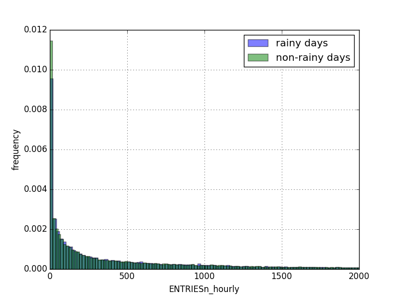
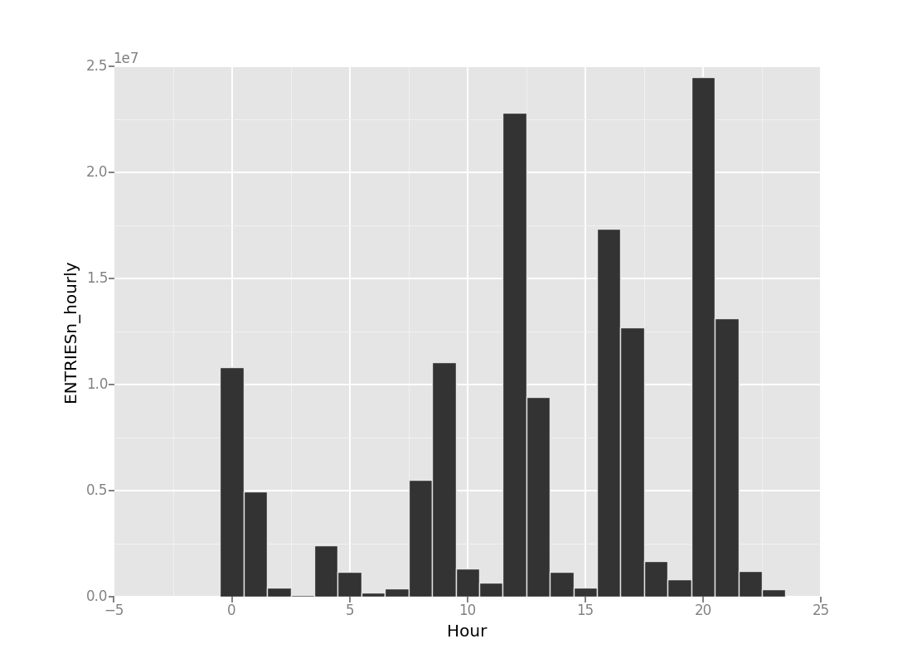

# Analyzing the NYC Subway Dataset
Questions
Overview
This project consists of two parts. In Part 1 of the project, you should have completed the questions in Problem Sets 2, 3, 4, and 5 in the Introduction to Data Science course.
This document addresses part 2 of the project. Please use this document as a template and answer the following questions to explain your reasoning and conclusion behind your work in the problem sets. You will attach a document with your answers to these questions as part of your final project submission.

## Section 0. References

Please include a list of references you have used for this project. Please be specific - for example, instead of including a general website such as stackoverflow.com, try to include a specific topic from Stackoverflow that you have found useful.


## Section 1. Statistical Test

**1.1 Which statistical test did you use to analyze the NYC subway data? Did you use a one-tail or a two-tail P value? What is the null hypothesis? What is your p-critical value?**

We use Mann-Whitney U Test to analyze the values of ```ENTRIESn_hourly``` in two populations, ```rain``` and ```no rain```. Mann-Whitney U-Test is a two-tailed test. The null hypothesis is that ```ENTRIESn_hourly``` is not interfered by rain. The calculated p-value of this test is 0.0249.

**1.2 Why is this statistical test applicable to the dataset? In particular, consider the assumptions that the test is making about the distribution of ridership in the two samples.**

Mann-Whitney U-Test is applicable to the dataset because this dataset conforms the underlying assumptions of Mann-Whitney U-Test: [1]
- The feature to be analyzed is ordinal and only has two groups.
- Each entries of the data is independent.
- The response is continuous.
- The response of each data entry is distinct.

The variable of this statistical test is whether the weather is raining, thus it is ordinal.
Also, it is reasonable to assume that ```ENTRIESn_hourly``` of each passenger is independent of each other when the population is large. Moreover, the values ```ENTRIESn_hourly``` can be considered as continuous and distinct.

**1.3 What results did you get from this statistical test? These should include the following numerical values: p-values, as well as the means for each of the two samples under test.**

The mean value of ```ENTRIESn_hourly``` in rainy days is 1105.45, while the mean value in non-rainy days is 1090.27. The p-value of Mann-Whitney U-Test is 0.025.

with rain: 1105.4463767458733,  
without rain: 1090.278780151855,   
U:1924409167.0,  
p:0.024999912793489721

**1.4 What is the significance and interpretation of these results?**

The p-value of this statistical test is 0.025, meaning that the probability that ```ENTRIESn_hourly``` in rainy days is stochastically larger than non-rainy days is 1-0.025=0.975. We can therefore claim that ```ENTRIESn_hourly``` in rainy days, with a confidence level of 97.5%.

## Section 2. Linear Regression

**2.1 What approach did you use to compute the coefficients theta and produce prediction for ENTRIESn_hourly in your regression model:  
Gradient descent (as implemented in exercise 3.5)  
OLS using Statsmodels  
Or something different?**

Simple linear regression that minimizes residual sum of squares were used in the model.

**2.2 What features (input variables) did you use in your model? Did you use any dummy variables as part of your features?**

We performed linear regression on the improved dataset ```turnstile_weather_v2.csv```.
The following features in the dataset were included in the model: ```rain```,```precipi```,```tempi```,```fog```,```pressurei```,```weekday```,```wspdi```,```hour```,```UNIT```,```day_week```,```conds```. The chosen dummy features are ```hour```,```UNIT```,```day_week```,```conds```.


**2.3 Why did you select these features in your model? We are looking for specific reasons that lead you to believe that
the selected features will contribute to the predictive power of your model.
Your reasons might be based on intuition. For example, response for fog might be: “I decided to use fog because I thought that when it is very foggy outside people might decide to use the subway more often.”
Your reasons might also be based on data exploration and experimentation, for example: “I used feature X because as soon as I included it in my model, it drastically improved my R2 value.”**

We started out by including almost all features that could potentially affect the ridership by intuition. After that we use *forward selection*[2] to choose the features that gives best R2 value. This process shows that *UNIT* and *hour* are the most important features that improve R2 values drastically, while the remaining features only affect R2 values very marginally. The details are summarized in the following table:

| selected features  | R2 values  |
| :------------ |:---------------:|
| all features| ~0.54 |
| all features but without *UNIT*      | ~0.19        |
| all features but without *UNIT* and *hour* | ~0.09        |

**2.4 What are the coefficients (or weights) of the non-dummy features in your linear regression model?**

|feature|theta|
|:-----:|:---:|
|tempi|-166.379582497|
|pressurei|-59.0098811531|
|precipi|-105.638141717|
|fog|-83.3775803727|
|rain|-11.144061792|
|wspdi|9.84768084141|
|weekday|-9.69549080398e+13|


**2.5 What is your model’s R2 (coefficients of determination) value?**

R2 value of this model is 0.548063308944.

**2.6 What does this R2 value mean for the goodness of fit for your regression model? Do you think this linear model to predict ridership is appropriate for this dataset, given this R2 value?**

The R2 value indicates that this model gives reasonable fit. It can describe the trend of the ridership well qualitatively, but may be not very good at predicting the exact number of the ridership.

## Section 3. Visualization

Please include two visualizations that show the relationships between two or more variables in the NYC subway data.
Remember to add appropriate titles and axes labels to your plots. Also, please add a short description below each figure commenting on the key insights depicted in the figure.

**3.1 One visualization should contain two histograms: one of ENTRIESn_hourly for rainy days and one of ENTRIESn_hourly for non-rainy days.
You can combine the two histograms in a single plot or you can use two separate plots.
If you decide to use to two separate plots for the two histograms, please ensure that the x-axis limits for both of the plots are identical. It is much easier to compare the two in that case.
For the histograms, you should have intervals representing the volume of ridership (value of ENTRIESn_hourly) on the x-axis and the frequency of occurrence on the y-axis. For example, each interval (along the x-axis), the height of the bar for this interval will represent the number of records (rows in our data) that have ENTRIESn_hourly that falls in this interval.
Remember to increase the number of bins in the histogram (by having larger number of bars). The default bin width is not sufficient to capture the variability in the two samples.**

The histogram are plotted as below. Note that the frequencies were normalized to the total entries of rainy and non-rainy days.




3.2 One visualization can be more freeform. You should feel free to implement something that we discussed in class (e.g., scatter plots, line plots) or attempt to implement something more advanced if you'd like. Some suggestions are:  
Ridership by time-of-day  
Ridership by day-of-week  

The follwing graph is the histogram of accumulated ```ENTRIESn_hourly```


## Section 4. Conclusion

Please address the following questions in detail. Your answers should be 1-2 paragraphs long.

**4.1 From your analysis and interpretation of the data, do more people ride
the NYC subway when it is raining or when it is not raining?**

From the analysis shown in the previous sections, we cannot reach a very firm conclusion that more people ride the NYC subway when it is raining or when it is not raining. More data or different statistical test is required to further confirm the result. Detailed explanation is described in the answer of next question.

**4.2 What analyses lead you to this conclusion? You should use results from both your statistical
tests and your linear regression to support your analysis.**

We performed Mann-Whitney U-Test and linear regression to investigate the relation between the ridership and rain. The p-value given by Mann-Whitney test is ~0.025, which is the probability that null hypothesis is true. Despite that the result of Mann-Whitney test gives us high confidence level that ```ENTRIESn_hourly``` increases in rainy days, however, the theta value of the feature "rain" calculated by linear regression is negative, suggesting that "rain" decreases ```ENTRIESn_hourly```. Moreover, it is difficult to see substantial difference of ridership in the histogram plotted in Section 3.1. As a result, we still cannot rule out that low p-value given by Mann-Whitney test is due to that the data in rainy days were biased by other factors.


## Section 5. Reflection

Please address the following questions in detail. Your answers should be 1-2 paragraphs long.

**5.1 Please discuss potential shortcomings of the methods of your analysis, including:  
Dataset,  
Analysis, such as the linear regression model or statistical test.**

Both the dataset and analysis have potential shortcomings. Firstly, the dataset only covers a single month of data, which may be to too short such that some short-term event or coincidences may affect the ridership of the subway. For example, if popular ball games or concert happened to be held in the rainy days, the result of the Mann-Whitney test performed in Section 1 becomes biased. Also, linear regression is not a very good model in predicting the ridership of the subway given the features provided by the dataset. Linear regression assumes that the response ```ENTRIESn_hourly``` is linear to the features, but this assumption does not hold in some cases. For example, if people tend to stay at home at extremely low or extremely high temperatures, the behavior cannot be described by a linear model. Moreover, it is highly likely that linear regression over fits the data, which requires further investigation.

**5.2 (Optional) Do you have any other insight about the dataset that you would like to share with us?**

The results of *forward selection* on linear regression shows that ```UNIT``` and ```hour``` are two of the most important features that affect the ridership in New Yorks' subway, while other weather factors do not affect the fitted R2 very substantially. In other words, this dataset shows that the time and location are the most important factors for ```ENTRIESn_hourly```.


## References

[1]	H. B. Mann and D. R. Whitney, “On a test of whether one of two random variables is stochastically larger than the other,” The annals of mathematical statistics, 1947.
[2]	G. James, D. Witten, T. Hastie, and R. Tibshirani, An Introduction to Statistical Learning, Section 6.1.1. New York, NY: Springer Science & Business Media, 2013.

